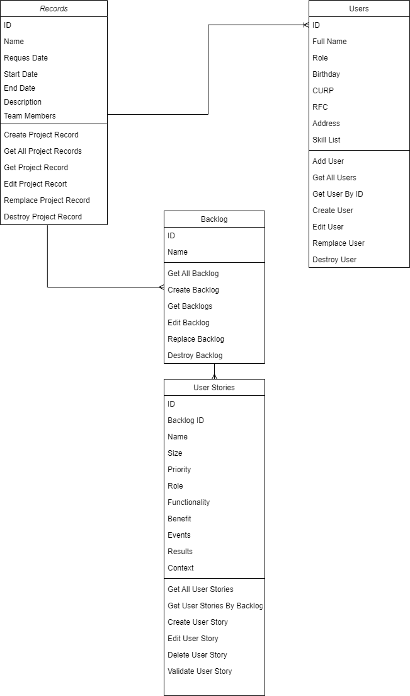
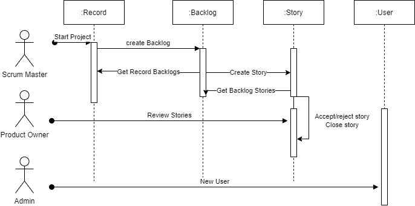

# Project Manager

This is an on-going final project for Web Platforms @UACH, class of AUG-DEC 2021.

## Team members
Alan David Varela Hernández <a271455@uach.mx>

Irvin Daniel Campos Valenzuela <329762@uach.mx>

Ericka Pamela Bermúdez Pillado <a28478@uach.mx>

## Diagrams
### Class diagram

### Sequence diagram 



## Installation

Use the package manager [npm](https://docs.npmjs.com/downloading-and-installing-node-js-and-npm) to install the dependencies, including [Express](https://expressjs.com/).

```bash
npm i
```

Then use the following command to run the project 

```bash
npm start
```

The app will run on port 3000.

## License
[MIT](https://choosealicense.com/licenses/mit/)